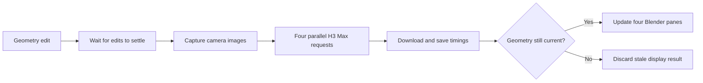

# H3 Neural Renderer for Blender

**Edit gray geometry in Blender and watch four H3 Max interpretations update beside it.**

[Download Windows preview](https://github.com/gokayfem/fal-blender-extension/releases/tag/neural-preview-0.2.0) · [Setup](docs/SETUP.md) · [Run the demo](docs/DEMO.md) · [Architecture](docs/ARCHITECTURE.md) · [Experiments](docs/EXPERIMENTS.md)

[](https://github.com/gokayfem/fal-blender-extension/raw/refs/heads/main/assets/demo/blender-neural-renderer.mp4)

**[Watch the demo](https://github.com/gokayfem/fal-blender-extension/raw/refs/heads/main/assets/demo/blender-neural-renderer.mp4)** — 720p, 3:48, actual Blender UI with instrumental music. The first wait is removed; a finished-view cover opens the recording. Panes loop **1.8-second moving excerpts** from fresh five-second outputs. [What the demo shows](docs/DEMO.md).

## GPT-6 Astra × H3 Max

GPT-6 Astra wrote the Blender geometry and orchestration scripts for the demo. H3 Max generates the visual interpretations through fal. **Astra is a development credit, not a runtime dependency or an API called by this extension.**

This is an experimental research fork of the [official fal.ai Blender extension](https://github.com/fal-ai/fal-blender-extension). It keeps the upstream generation suite and adds **H3 Live**. It does not replace Eevee or Cycles.

## What it does

- Four concurrent looks: **cartoon, claymation, realistic, and gouache**.
- Neutral gray source geometry, fixed-camera image guidance, and moving video panes.
- Automatic refresh after edits settle; idle scenes do not repeatedly generate.
- Stale-result rejection when geometry changes during a request.
- Local captures, full videos, preview excerpts, and timing metadata.
- A reproducible ship build, from a simple hull and wheelhouse to a detailed research vessel.

The current demo uses **image references only**. Text defines the styles; abstract swatches are excluded because they sometimes leaked into the generated background.

## Quick start

Demonstrated on **Blender 5.1.2 / Windows x64**. Other versions and platforms need validation.

1. [Download the Windows extension ZIP](https://github.com/gokayfem/fal-blender-extension/releases/tag/neural-preview-0.2.0) and [install it](docs/SETUP.md), or build for your platform.
2. Enable **fal.ai — AI Generation Suite** and configure a fal API key in preferences, or provide `FAL_KEY` in Blender's environment.
3. Press **N → H3 Live** in a 3D Viewport.
4. Choose **Cartoon / clay / real / painted**, clear the style-reference manifest, and use a scene camera.
5. Start the four-style grid, edit geometry, and wait for fresh results.

Each four-pane refresh submits **four paid requests**. Stop prevents new requests; already accepted work may finish and be billed. See [current model information](https://fal.ai/models/minimax/h3-max/reference-to-video).

To reproduce the recorded build after installing the extension and FFmpeg:

```sh
git clone https://github.com/gokayfem/fal-blender-extension.git
cd fal-blender-extension
# Copy .env.example to .env and fill FAL_KEY locally.
python scripts/run_demo.py --blender /path/to/blender --env .env --output outputs/my-demo --generate
```

This opens a new factory-startup scene and makes eight batches / 32 clips. [Windows example and recording guide](docs/DEMO.md).

## How it works



Blender data access and capture stay on the main thread; HTTP and downloads run in workers. The model receives **images and prompts, not the mesh itself**.

## Experimental means experimental

This is an **asynchronous neural preview**, not frame-by-frame real-time rasterization.

- Geometry, small details, camera and style can drift.
- Full clips can contain transitions. The demo trims moving sections; this is not proof of transition-free generation.
- Short video loops can have visible seams.
- Inference time is only part of latency: capture, prompt expansion, API turnaround, download and display all count.
- The demo does not establish sub-second four-pane updates or exact geometry fidelity.

A 56-clip reference study found old geometry returning and new fittings arriving midway through clips. [Results and remaining questions](docs/EXPERIMENTS.md).

## Development

```sh
blender --background --factory-startup --python-exit-code 1 --python tests/test_h3_live.py
python scripts/check_repository.py
```

H3 tests mock HTTP and do not spend API credits. Install the extension dependencies first. [Contributing and testing](CONTRIBUTING.md).

| Area | Entry point |
| --- | --- |
| Viewport and requests | [live_preview.py](live_preview.py) |
| Four-style scheduling and playback | [live_grid.py](live_grid.py) |
| Geometry capture and references | [camera_guidance.py](camera_guidance.py), [image_guidance.py](image_guidance.py) |
| Style and construction prompts | [surface_prompts.py](surface_prompts.py), [stage_prompts.py](stage_prompts.py) |
| Recorded ship build | [scripts/fresh_moving_build.py](scripts/fresh_moving_build.py) |
| Inherited generation suite | [Upstream guide](UPSTREAM_GUIDE.md) |

## Credits and license

Research fork and demo by [Gokay](https://github.com/gokayfem), developed with GPT-6 Astra. H3 Max generation on [fal](https://fal.ai). Instrumental music: ElevenLabs Music via fal. Upstream extension by Benjamin Paine and Features and Labels, Inc.

Code retains **[GPL-3.0-or-later](LICENSE)** and upstream copyright notices. Hosted services and generated media remain subject to their respective terms; the code license does not grant model access. [Media provenance](assets/demo/README.md).
