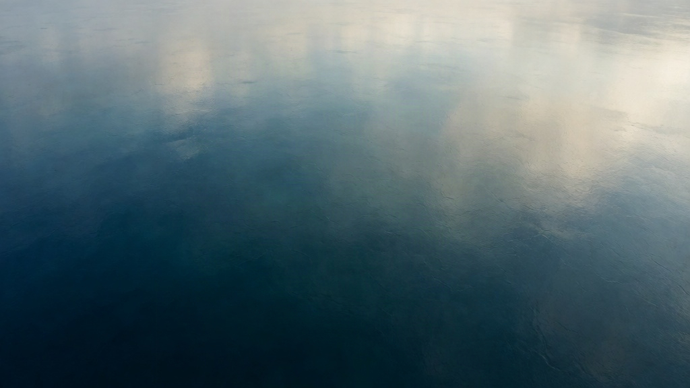
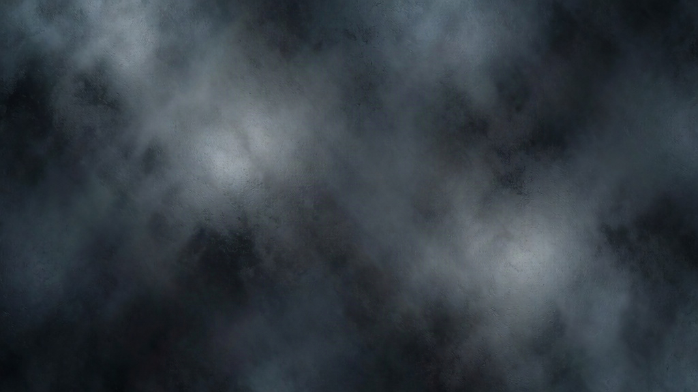
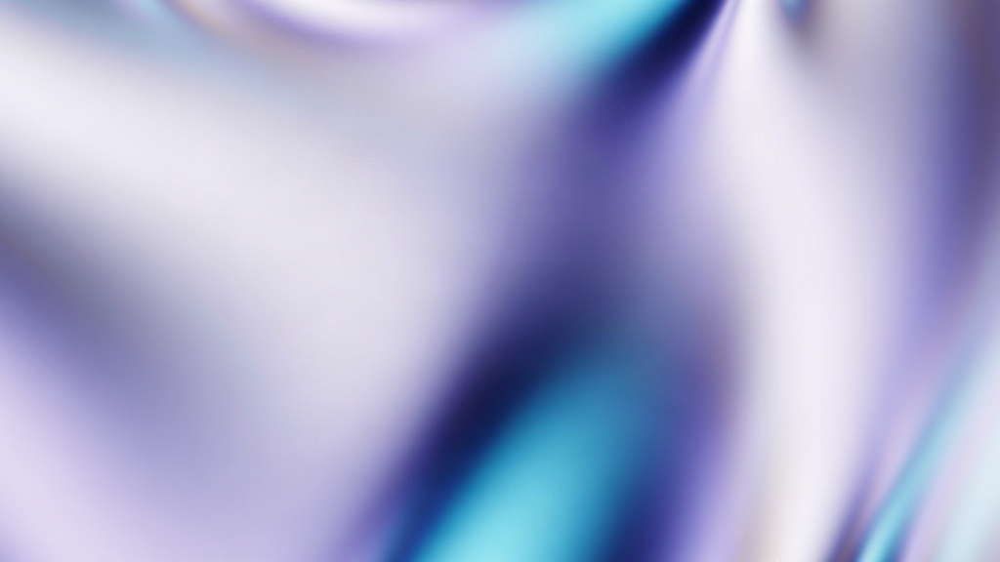
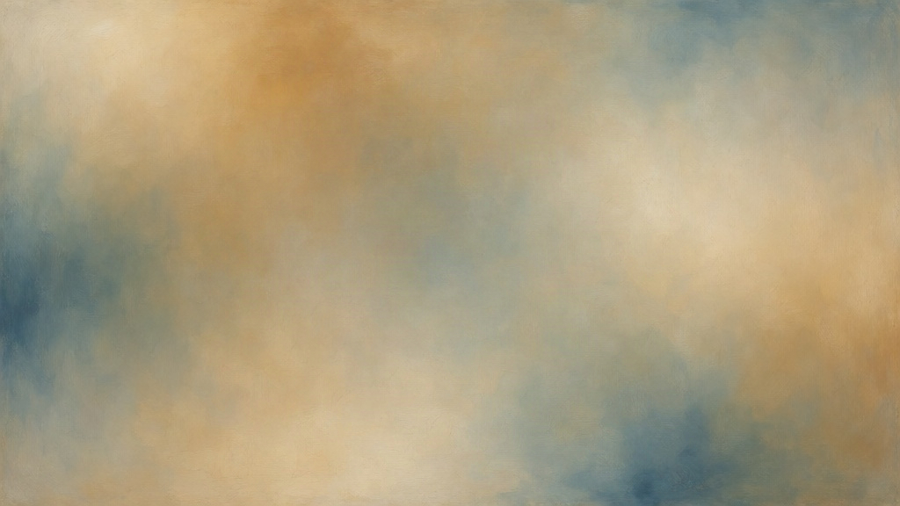

# Fixed object-free style references

The four JPEGs in `assets/h3-style-references/` were generated with
[Krea 2 Turbo](https://fal.ai/models/fal-ai/krea-2/turbo), using its
[official schema](https://fal.ai/models/fal-ai/krea-2/turbo/llms.txt), verified
September 6, 2026. Each is 1024×576, with a fixed seed, prompt expansion disabled,
and safety checking enabled. Generation plus download took 2.75–3.33 seconds per
image in this run. Each image was visually inspected: none contains a recognizable
object, vehicle, person, structure, text, or discrete reference subject.

| Reference | Purpose |
|---|---|
| `expedition.jpg` | Navy, teal and ivory; broad natural light; satin response |
| `storm.jpg` | Charcoal, slate and cold silver; wet texture; diffuse storm light |
| `orbital.jpg` | Pearl, lavender, indigo and cyan; smooth iridescent reflections |
| `miniature.jpg` | Warm cream, muted navy and teal; matte pigment; soft warm light |

| Daylight | Storm |
|---|---|
|  |  |
| **Pearl / cyan** | **Warm matte** |
|  |  |

The H3 grid uses two images per request: **Image 1 is current geometry; Image 2 is
that pane's fixed style reference**. Prompts separate their roles explicitly. The
same image bytes are reused throughout a session. The manifest stores file names,
seeds, prompts, provenance and SHA-256 hashes. A changed image fails validation;
changing the manifest setting requires restarting the grid. There is no automatic
style-image regeneration.

The geometry is a design proxy, not a surface that must retain its tessellation.
H3 is instructed to preserve major components, layout, proportions and assembly
stage, while refining existing components into manufactured surfaces. A bare hull
stays a bare hull; coarse shading facets should become smooth hull plating. Real
glazing, tubular rails and other role-specific surface treatment follow components
already present. This balances semantic interpretation with component fidelity.

Fixed references improve conditioning consistency; they do not provide a hard
style lock or guarantee exact geometry, camera or temporal consistency. The
four-pane bare-hull and full-ship probes were inspected before the live demo.

To deliberately create a new reference set, choose a new output folder:

```text
python scripts/generate_style_references.py --env /path/to/.env --output /new/style/folder
```

The generator refuses to overwrite an existing manifest. Set **Fixed style
references** in H3 Live to the new manifest and restart the grid. Clear that field
to run without style images. Reopening a saved scene still requires a configured
fal key; the scene and manifest do not contain the API key.
